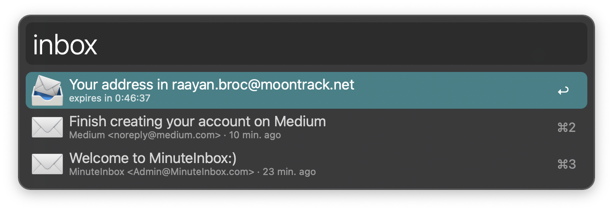
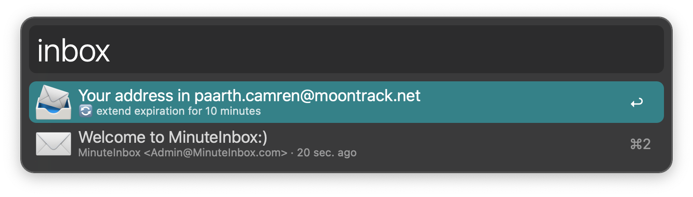
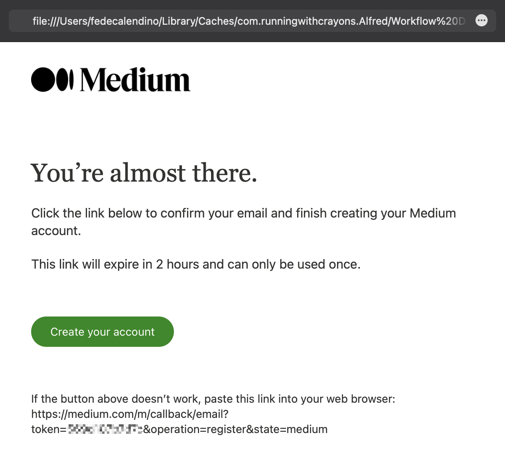

## ALFRED-MINUTE-INBOX

[Alfred Workflow](https://www.alfredapp.com/workflows/) to get a disposable email address 📨️

### Description:

Fully working disposable email address using minuteinbox.com's api. 

#### Usage:

* Press `enter` on the first item (📨) to copy the email address into your clipboard.
  * Press `command + enter` or `option + enter` to extend the expiration by 10 minutes.

* Press `enter` on any of the emails (✉️) to open a local copy of its contents in your browser.
  * This copy will have any javascript on it removed, as a security measure.

